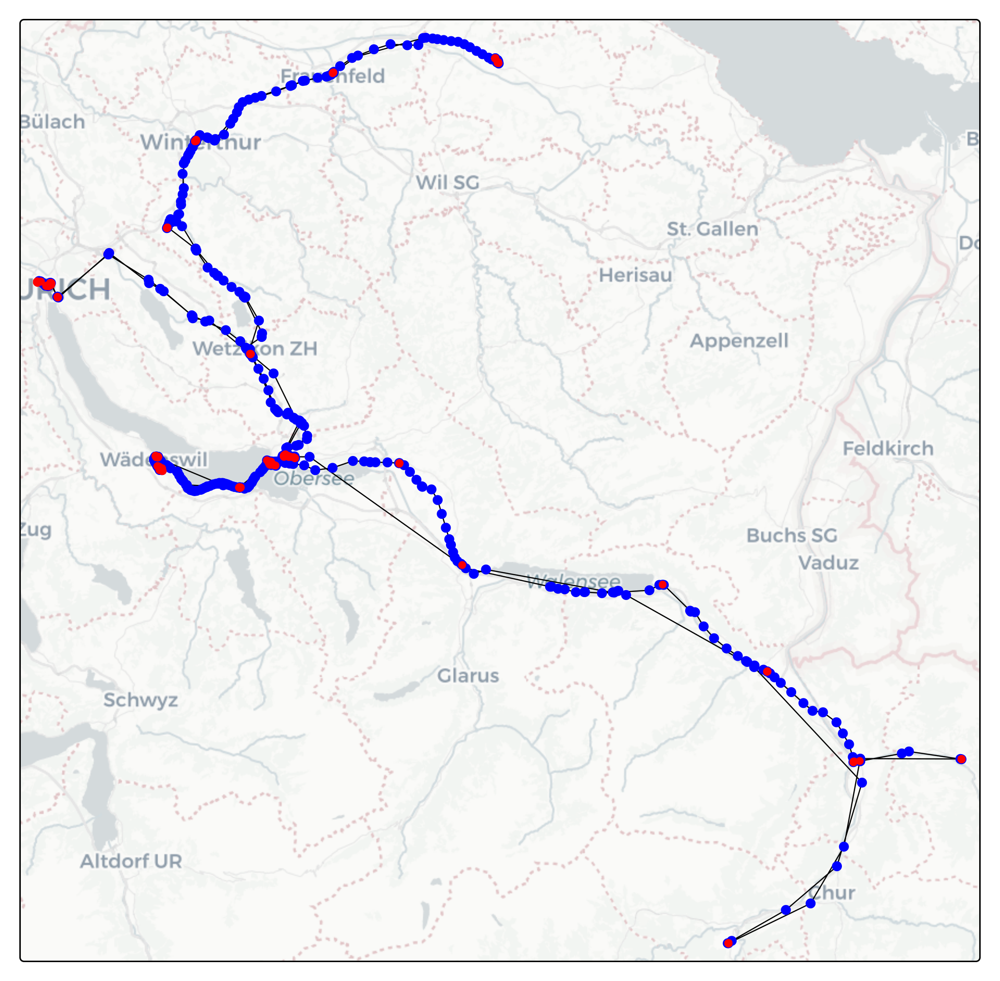
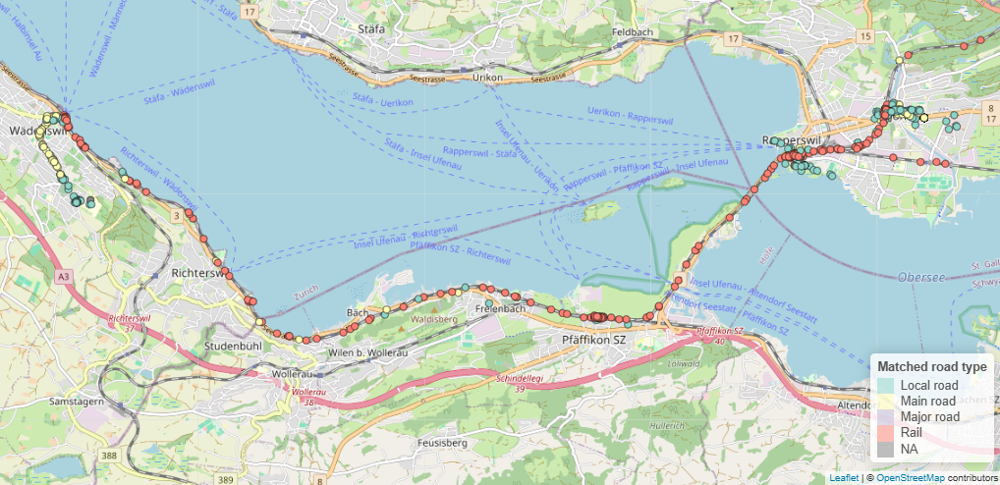
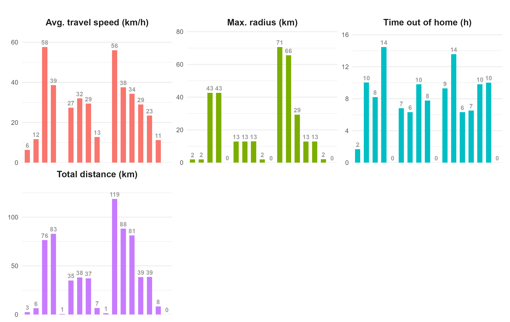

# Results

## Google timeline data

After moderate pre processing effort, the google timeline data over more than two weeks looks like in @fig-move_google. Blue are the movement points and red are the static points. As some of the trajectories have little data points, the travelled distances and speed are likely to be underestimated.

{#fig-move_google}

In the google timeline data, the accuracy is stated to be up to several hundred meters. Therefore the matching with roadtypes can be difficult, as roads are only few meters wide. An example of road type mismatch is the way from home to ZHAW and back in @fig-road_type_mismatch. From Rapperswil train station to Wädenswil train station, only the train was used. But in the road type matching, several points are not matched as 'Train' and sometimes even far away from the railroads.

{#fig-road_type_mismatch}

Another attempt to evaluate the accuracy of the road type matching is to have a look at the from google stated activities at these points. Of course these activities can be wrong as well, but as they include more than the coordinates of the points (acceleration etc.) in their analysis, it is estimated to be more accurate. The percentages of different road types within the different google activities is shown in @fig-road_type_activity.

{#fig-road_type_activity}

At a first glance, some of the road types seem to be matched very wrong, but most of them can somehow be explained. The 26% of walking on the rail might be the changing of trains at train stations, the tram line is inside of the main road and therefore 68% matched with it. Nevertheless, a lot of the 4% to 15% (e.g. cycling on rail or train on local road) cannot be explained, other than errors.

The other parameters are calculated once per day and once an average over the whole tracking period. In @fig-param_day it is shown, that the parameters vary widely at different days.

{#fig-param_day}

## GPS data

## Comparison

